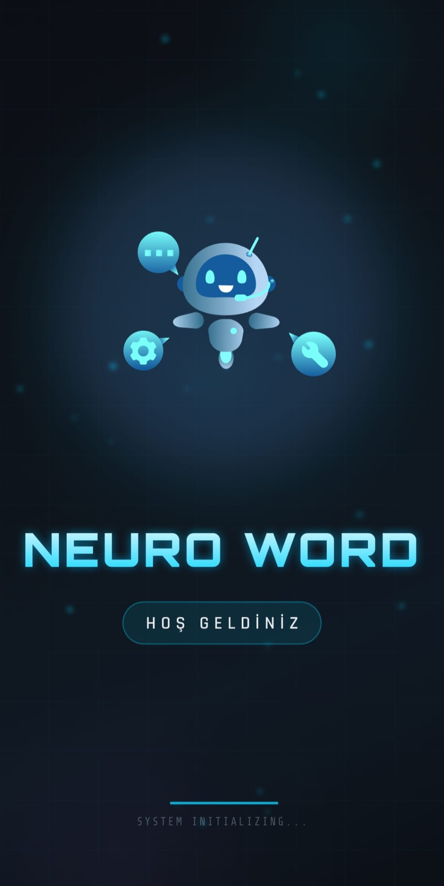
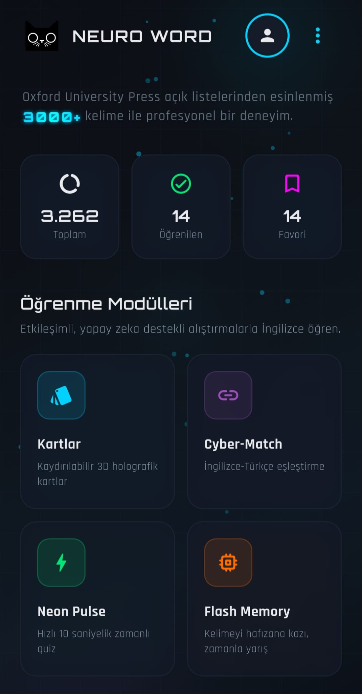
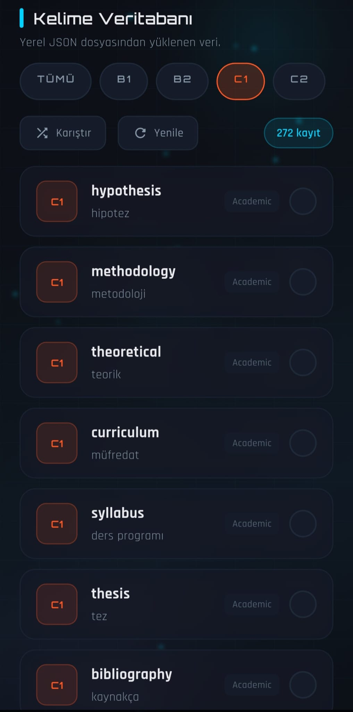
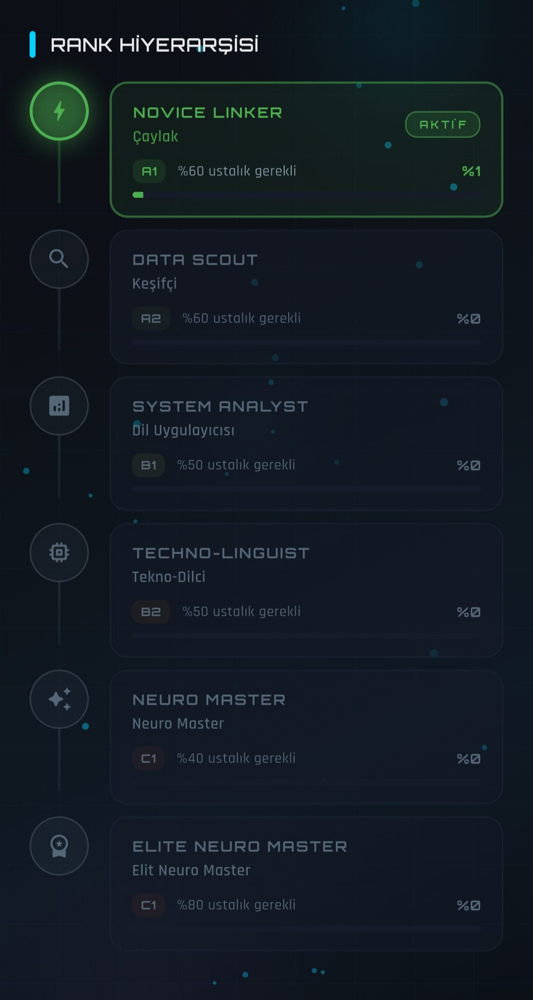

# 🧠 NEURO WORD
### "Geleceğin Kelime Öğrenme Deneyimi - Şimdi Cebinizde!"

 

 

**Neuro Word**, sıradan dil öğrenme uygulamalarından sıkılanlar için tasarlandı. 
Yapay zeka estetiği, fütüristik grafikler ve oyunlaştırılmış öğrenme modülleriyle kelime haznenizi bir üst seviyeye taşıyın.

---

## 📸 Uygulama İçi Görseller (Tanıtım)
<table>
  <tr>
    <td> <b>Fütüristik Karşılama</b></td>
    <td> <b>Cyber Match & Modlar</b></td>
    <td> <b>Gelişmiş Filtreleme</b></td>
    <td> <b>İlerleme Takibi</b></td>
  </tr>
</table>

*(Not: Resimlerin üzerine tıklayarak büyütebilirsiniz.)*

---
## 🚀 Neden Neuro Word ile Öğrenmelisiniz?

Uygulamamız, modern yazılım dünyasının en yeni trendlerini dil eğitimiyle birleştiriyor:

* 🤖 **Sibernetik Asistan:** Sizi fütüristik bir robot eşliğinde karşılayan görkemli açılış deneyimi.
* ⚡ **Rekabetçi Modlar:** Neon Pulse ve Cyber Match ile zamanla yarışarak kelime bilginizi test edin.
* 💾 **Kişisel Sözlük:** Kartlar bölümünde öğrendiğiniz her kelimeyi tek tuşla profilinize kaydedin.
* 📊 **Veri Analizi:** Hangi gün kaç kelime öğrendiğinizi ve toplam ilerlemenizi anlık olarak takip edin.

---

## 🛠️ Teknik Kurulum ve Başlatma

Projeyi yerel ortamınızda en yüksek performansta çalıştırmak için:

> [!IMPORTANT]  
> Hata almamak için `flutter clean` komutunu atlamayınız.

1.  **Klonlayın:** `git clone https://github.com/Selam47/neuro_word.git`
2.  **Klasöre Geçin:** `cd neuro_word`
3.  **Önbelleği Temizleyin:** `flutter clean`
4.  **Paketleri Çekin:** `flutter pub get`
5.  **Uygulamayı Uçurun:** `flutter run`

---

## 🎖️ Geliştirici Ekibi

Bu proje, büyük bir tutku ve ekip çalışmasının ürünüdür:

#### ⚙️ DevOps & Sistem Mimarisi
* **Abdullah Kaya**

#### 👑 Proje Lideri & Baş Geliştirici
* **Abdülselam Kaya**

#### 🎨 Tasarım & UI/UX Ekibi
* **Hasan Düzgör** | **Yusuf Serhat Temel** | **Eren Demir**

#### 💻 Frontend Geliştirme
* **Melik Kaya** | **Sevgi Kaya**

#### 🔙 Backend & Veri Yönetimi
* **Mehmet Ali Guda** | **Serhat Enes Uçan** | **Adnan Sami**

---

## 📧 İletişim

Sorularınız ve iş birliği teklifleriniz için bize ulaşın:

📩 **E-posta:** [abdulselam4763@gmail.com](mailto:abdulselam4763@gmail.com)  
📍 **Geliştirici:** Abdülselam Kaya

 
<b>Neuro Word © 2026 - Dil Öğrenmenin Geleceği</b>

